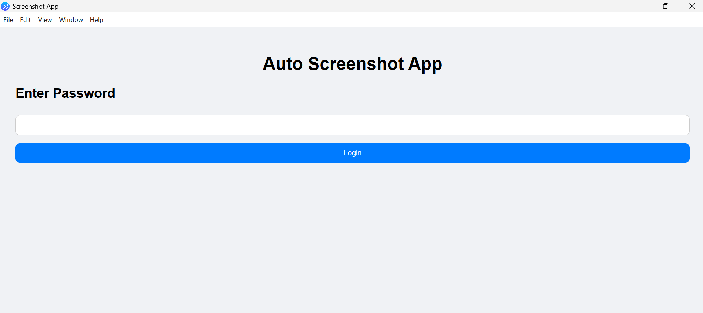

# 📸 CaptureMate - Auto Screenshot Electron App

CaptureMate is a lightweight, desktop Electron application that takes automatic screenshots at regular intervals. It supports custom save paths, secure access via password, system tray integration, and shows notifications with a live preview of screenshots.

---

## 🚀 Features

- 🔐 **Password Protection** (default password: `1234`)
- ⏱️ **Auto Screenshot** with custom interval (in seconds)
- 🖼️ **Format Selection** (PNG / JPEG)
- 📁 **Choose Save Directory** — or defaults to your Desktop
- 🗂️ **Date-wise Folder Organization**
- 📌 **System Tray** support with background running
- 🖥️ **Open Recent Screenshots** directly from the app
- 🔔 **Desktop Notifications** for every capture

---

## 🧠 How It Works

1. User logs in using a password.
2. Sets screenshot interval (e.g., every 5 seconds).
3. Chooses the format and destination folder.
4. App minimizes to system tray and runs silently.
5. Screenshots are saved in `YYYY-MM-DD` folders with timestamps.
6. Notifications pop up after each capture, with a clickable list of recent screenshots.

---

## 🛠️ Installation

### Clone and install dependencies

```bash
git clone https://github.com/your-username/CaptureMate.git
cd CaptureMate
npm install

💻 Run the App in Development
npm start
📦 Build Desktop App (Windows)
npm run dist
📸 Screenshot Preview
login screen:

